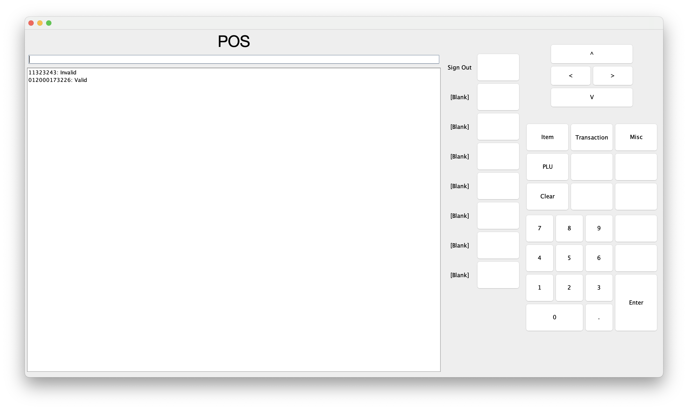

# Map-based Point of Sale

**MapPOS** is an experimental point-of-sale system. It's purpose is to reflect what is going on in store and present a more intuitive interface. Everything in store is visualized as a virtual object
on-screen.

## Introduction 
After being in retail for 10+ years, several features of point-of-sale systems bother me, one of which is design over function. Most of the Windows-based POS systems market to consumers via graphics. Though I have no qualms about this, it ties up development time from other features.

## Problems to Explore
The following are problems that cashiers and customers would like addressed:

* Software Crashes
* Ergonomics
* Keystroke Waste
* Hunting and Pecking
* Lack of product knowledge
* Interface is not standardized
* Lack of customization

## Concepts
* Standardization
 * Make use of OMG ARTS Retail Modeling http://www.omg.org/retail/operational-data-model.htm
* Map-oriented. Reflect a stores floorplan without having to create a full 3D environment.
* Stable. POS systems should work like calculators with added rules. Crashing should be impossible.
* Helpful. Let employees do what they do best.
* Modular hardware and software.
  * Can be expanded.
  * Technicians can add or remove pieces freely.
  * Can still run at base level.

## Wanted Features
There are certain features that I would love in a retail system.

### Technical
* Stable core.
  * Transactions lost on software crashes.
  * Experimental features added as stable, main features.
  * No alternative methods.
  * UI forces user to adapt, instead of the UI adapting.
* Tough
  * Able to handle heavy-duty use.
  * Able to function without restarts.
  * Able to function with missing equipment.
* Equipment management
  * Detection.
  * Notification about problems.
  * Hotplugging.
* No restart update.
* User customizable.
  * Per user.
  * Customizations transfer to any POS.
* Predictive text.
  * Reduce typing.
* Offline-First
  * Features have at least a minimal backup.

### Enchancement
* Product knowledgebase, including employee submitted information.
* Floormap/Planogram viewer/editor.
* Unknown UPC handling.
* Damaged barcode/UPC recovery.
  * Fill in missing digit.
* Check digit calculator.
* Weight/price based UPC creator.
  * Creates UPC from base and weight.
  * 0-12345-00000 and 1.00 lb -> 0-12345-01000-5
 * Key Dump feature

### Project Management
* DevOps development.
  * Add features operators want.
* Standardization.
  * Customers are confused by Self-Serve Checkouts.

## Screenshots
